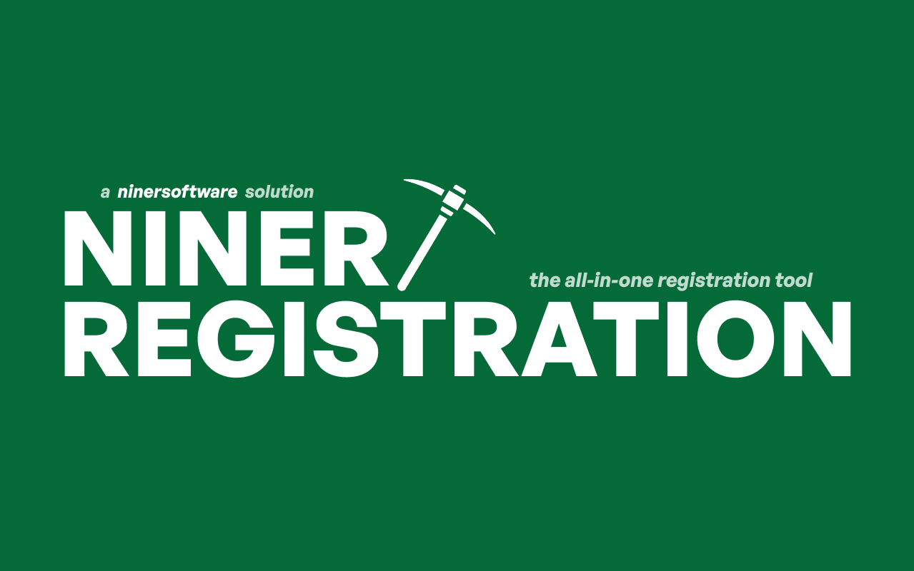

# Niner Registration



**Niner Registration** is an all-in-one registration enhancement for UNC Charlotte students, built by [ninersoftware](https://github.com/ninersoftware).

Niner Registration improves the course registration experience by bringing professor ratings, historical grade data, expanded course information, schedule planning, and other useful tools directly into the UNC Charlotte registration portal.

## Features

* **Grade History**: View public historical grade distributions for courses, with data ranging back to Fall 2015.
* **Rate My Professors Integration**: View professor ratings directly while searching for courses without switching between tabs.
* **Detailed Course View**: Open an expanded interface containing course information, professor data, and historical grades.
* **Calendar Builder**: Build your class schedule directly within the extension and export it as an `.ics` file for Google Calendar, Apple Calendar, and other calendar applications.
* **Themes**: Customize the registration interface with black, green, and white themes.
* **Faster Course Data**: Cached course and professor information keeps repeated lookups fast.
* **Redesigned Interface**: A cleaner and more modern registration experience with updated typography and styling.

## Installation

### Chrome Web Store

Niner Registration is available on the Chrome Web Store.

[Install Niner Registration](https://chromewebstore.google.com/detail/niner-registration/fiboihoabbagmckkhjbbeiaoiiimfaec?hl=en-US)

### Manual Installation

To install Niner Registration manually as an unpacked Chrome extension:

1. Clone the repository:

```bash
git clone https://github.com/ninersoftware/Niner-Registration.git
```

2. Open `chrome://extensions/` in Chrome.

3. Enable **Developer mode**.

4. Click **Load unpacked**.

5. Select the `NinerRegistration` folder from the cloned repository.

6. Open the UNC Charlotte registration portal. Niner Registration will automatically integrate with the page.

## Development

Clone the repository:

```bash
git clone https://github.com/ninersoftware/Niner-Registration.git
cd Niner-Registration
```

Make your changes, then reload the extension from `chrome://extensions/` to test them.

## Contributing

Contributions are welcome.

To contribute:

1. Fork the repository.
2. Create a new branch for your feature or fix.
3. Make and test your changes.
4. Commit and push your branch.
5. Open a Pull Request describing your changes.

For larger changes, consider opening an issue first to discuss the proposed update.

## About ninersoftware

**ninersoftware** is a student software collective at UNC Charlotte building open-source tools for the Charlotte community.

Our goal is to build software that improves the student experience at UNC Charlotte.

## Bug Reports and Feature Requests

If you encounter a bug or have an idea for Niner Registration, open an issue in the repository.

When reporting a bug, please include:

* A clear description of the issue
* Steps to reproduce it
* Expected behavior
* Screenshots or logs when applicable

## License

See the repository license for information about using and contributing to Niner Registration.
